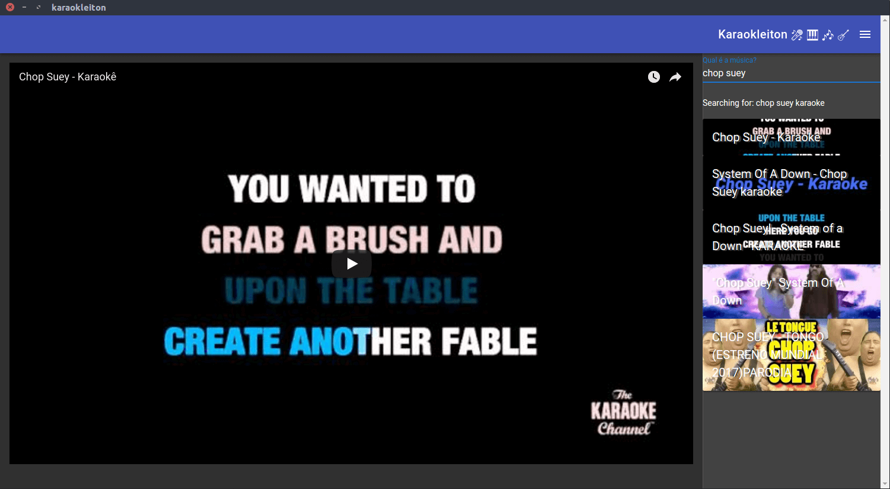

# karaokleiton

> A funny karaoke app

#### Screenshots




#### Build Setup

``` bash
# install dependencies
npm install

# serve with hot reload at localhost:9080
npm run dev

# build electron application for production
npm run build


# lint all JS/Vue component files in `src/`
npm run lint

```

#### How to set up your computer's microphone return

By default most computers don't play back the audio from connected microphones. If you want to use a microphone connected to your computer, there are some ways to make this happen. This one was tested on Ubuntu.

1. Install PulseAudio Volume Control. On Linux (debian based):

`sudo apt-get install pavucontrol`

2. Route the microphone output to the speakers 

`pactl load-module module-loopback latency_msec=1`

3. Enjoy =)

You can change the microphone volume in `System Settings > Sound > Input > Input volume`.

To turn off the microphone return, run `pactl unload-module module-loopback`


---

This project was generated with [electron-vue](https://github.com/SimulatedGREG/electron-vue)@[1c165f7](https://github.com/SimulatedGREG/electron-vue/tree/1c165f7c5e56edaf48be0fbb70838a1af26bb015) using [vue-cli](https://github.com/vuejs/vue-cli). Documentation about the original structure can be found [here](https://simulatedgreg.gitbooks.io/electron-vue/content/index.html).
